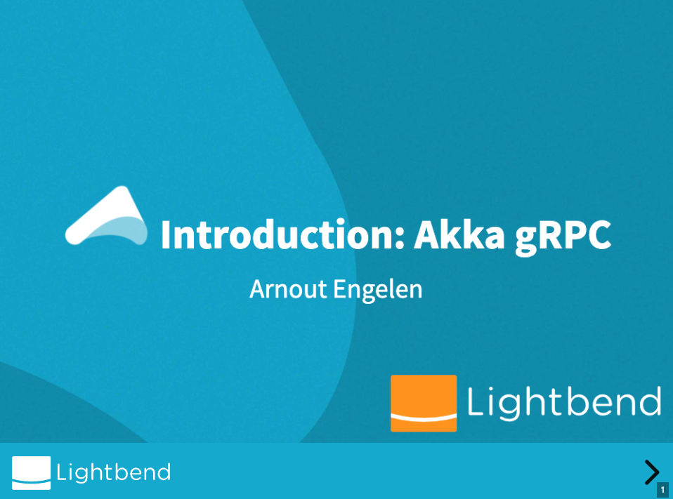

# Getting started

## Akka gRPC Quickstart

To try out Akka gRPC and understand how the development process might work out, try the [Akka gRPC Quickstart with Scala](https://developer.lightbend.com/guides/akka-grpc-quickstart-scala/) or the [Akka gRPC Quickstart with Java](https://developer.lightbend.com/guides/akka-grpc-quickstart-java/).

## Video Introduction

This short video on YouTube shows how easy it is to create a gRPC server with Akka gRPC.

